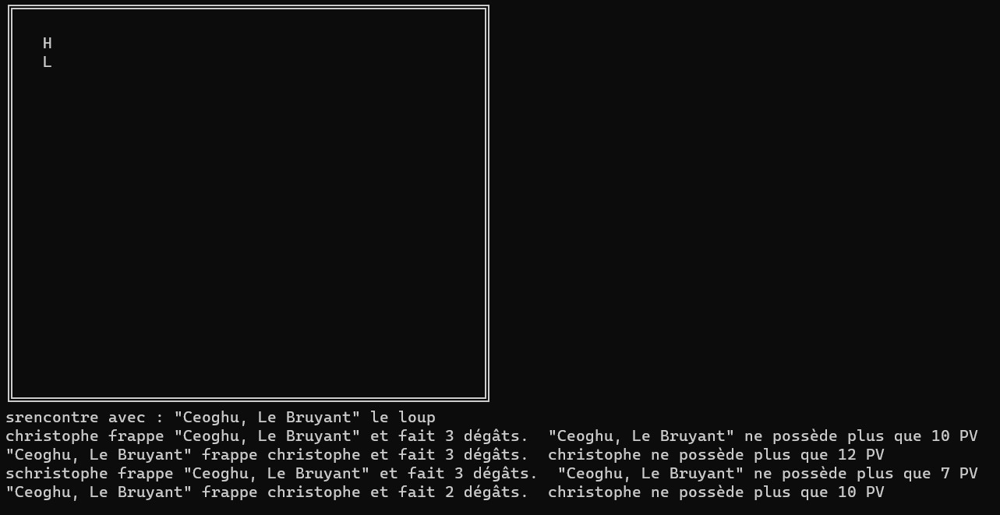

# HEROS VS MONSTER

# Pourquoi ?

Le projet "Heroes Vs Monsters" est la finalité du cours de C# Orienté Objet, le but était de gérer les classes afin de créer des personnages héros et des monstres

## Quoi ?

Le projet comprend les features suivantes

1. des personnages
	qui ont tous une force et une endurance, déterminés en lançant 4 dés à 6 faces et en additionnant les 3 résultats les plus haut
	un bonus de force et un bonus d'endurance qui dépend directement de la caractéristique principale.  Elle est égale à -1 si la caractéristique dont elle dépent est inférieure à 5, +1 entre 10 et 14 et +2 si elle est supérieure à 14'
    des points de vie qui sont égaux à l'endurance + bonus d'endurance
	un positionnement dans la grille sous la forme de X,Y

	les personnages sont divisés entre héros (nain ou humain) et monstre (Orc, loup ou Dragon)

2. Une grille
	délimités par des caractères ascii qui représentent la burdure du "plateau de jeu"

3. Un système de combat simple, lorsqu'un personnage frappe, il inflige d'office 1D4 points de vie + son bonus de force
si le héros gagne le combat, il gagne le butin que le monstre transportait (de l'or pour les orcs, du cuir pour les loups et les 2 pour les dragons')

## Comment Exécuter le Projet

Pour exécuter ce projet, suivez ces étapes simples :

Clônez ce dépôt GitHub dans votre espace de travail.

Ouvrez le projet dans votre environnement de développement C# préféré.

Compilez le programme.

Exécutez le programme.

Suivez les instructions affichées dans la console pour jouer au jeu.

## Règles du jeu

Lancez le jeu, entre votre nom, choisissez si vous voulez jouer un humain (+1 en Force et Endurance) ou un nain (+2 en endurance) puis de la taille du plateau et du nombre de monstre à rencontrer

pour déplacer votre personnage, représenté par la lettre H (comme Heros) vous pouvez utiliser les touches Z, Q, S, D.  
Les monstres sont invisibles jusqu'à ce que le personnage se déplace sur une case adjacente et est représenté par un O pour les orques, L pour les loups et D pour les dragons
Le jeu se termine lorsque le héros est mort ou lorsqu'il a tué tous les monstres du plateau

Ce projet a été conçu comme une base solide pour l'apprentissage de la programmation C# et de la programmation orientée objet. Nous encourageons vivement les contributions, les signalements de problèmes, ainsi que les propositions d'améliorations. Votre feedback est précieux pour notre apprentissage collectif.